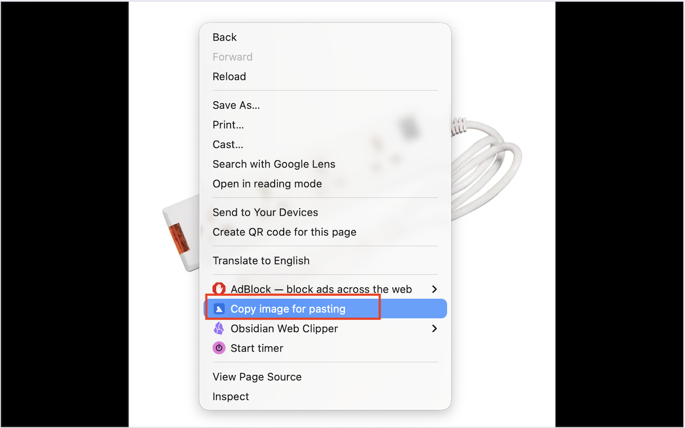

# Google Photos Clipboard Fix

A Chrome extension that fixes image copying from Google Photos. When you copy images from Google Photos, they often paste as broken references in blog editors and other apps. This extension adds a right-click **"Copy image for pasting"** option that copies the actual image data (PNG) to your clipboard, so it pastes correctly everywhere.

## The Problem

Google Photos doesn't put real image data on the clipboard when you copy. Instead, it copies a reference or thumbnail that many apps can't use. This means pasting into blog editors, email composers, or design tools often results in broken images or nothing at all.

## How It Works

1. Open a photo on [Google Photos](https://photos.google.com)
2. Right-click the image
3. Select **"Copy image for pasting"**
4. Paste into any app — the full image is on your clipboard

The extension uses multiple strategies to grab the image reliably:
- **Method A:** Reads pixels directly from the on-page image element (fastest, most reliable)
- **Method B:** Fetches the full-resolution image via the background service worker (bypasses CORS)
- **Method C:** Loads the image with crossOrigin canvas as a fallback

## Installation

### From Chrome Web Store
*(Coming soon)*

### Manual Install (Developer Mode)
1. Download or clone this repository
2. Open `chrome://extensions/` in Chrome
3. Enable **Developer mode** (top right)
4. Click **Load unpacked** and select this folder

## Permissions

| Permission | Why |
|---|---|
| `clipboardWrite` | Write image data to your clipboard |
| `activeTab` | Read image elements on the active Google Photos tab |
| `contextMenus` | Add the "Copy image for pasting" right-click menu item |
| Host access | Fetch full-resolution images from Google's image CDN |

## Privacy

This extension does not collect, store, or transmit any user data. All image processing happens locally in your browser. See the full [Privacy Policy](PRIVACY.md).

## License

MIT
